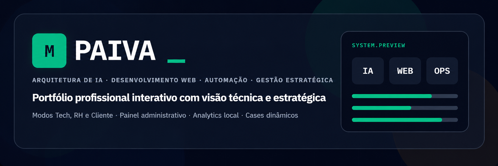
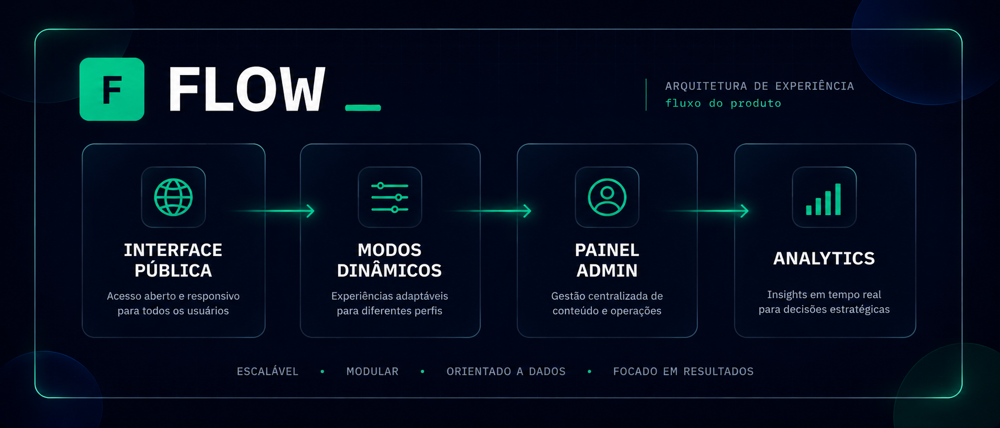
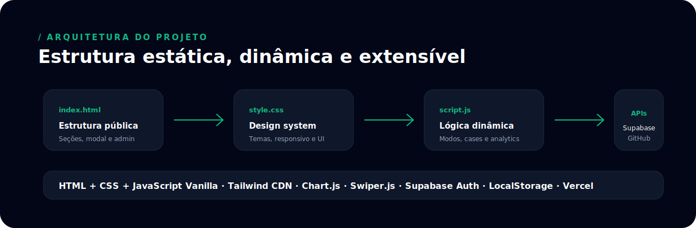
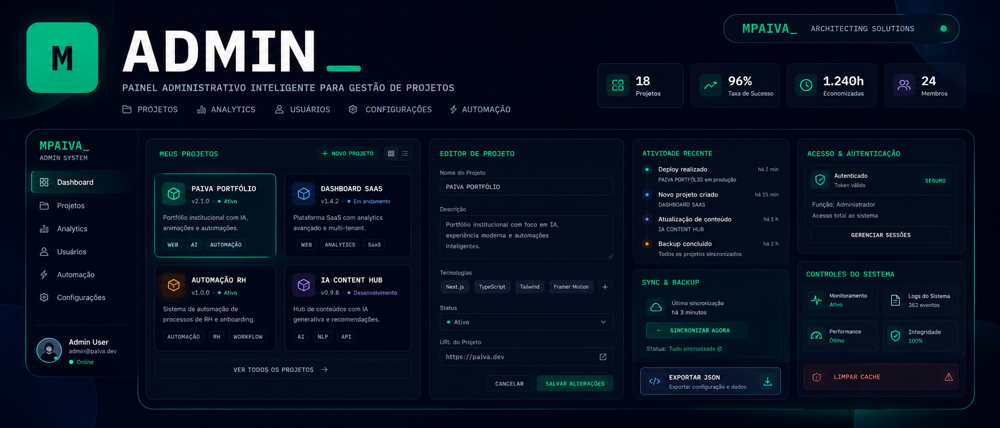
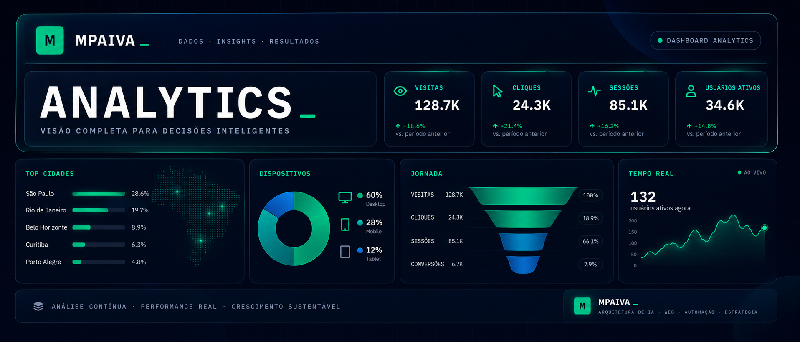
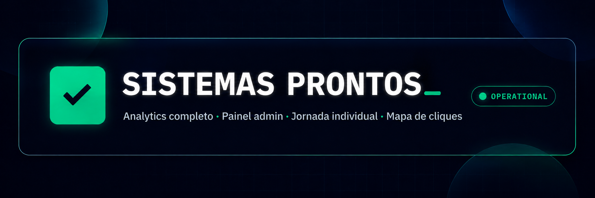

<div align="center">



<br><br>

<h1>MPAIVA_</h1>

<h3>Portfólio profissional com IA, automação, desenvolvimento web, gestão estratégica e analytics próprio.</h3>

<p>
  Uma experiência digital criada para apresentar perfil profissional, projetos reais, serviços, cases, painel administrativo e inteligência de visitas em tempo real.
</p>

<p>
  <a href="https://upaiva.dev/"><strong>Acessar site</strong></a>
  ·
  <a href="https://github.com/EoPaiva"><strong>GitHub</strong></a>
  ·
  <a href="https://www.linkedin.com/in/mateus-paiva-19804b284"><strong>LinkedIn</strong></a>
</p>

</div>

---

<div align="center">

## STACK PRINCIPAL

<br>

<h3>LINGUAGENS BASE</h3>

<p align="center">
  
  
  
  
</p>

<br>

<h3>UTILITÁRIOS DE INTERFACE</h3>

<p align="center">
  
  
  
</p>

<br>

<h3>DADOS, AUTENTICAÇÃO E DEPLOY</h3>

<p align="center">
  
  
  
  
  
</p>

</div>

---

<div align="center">

## ◢ VISÃO GERAL

</div>

> O **MPAIVA_** não é apenas um currículo online.
>
> É uma plataforma pessoal que combina apresentação profissional, serviços digitais, projetos publicados, painel administrativo e analytics próprio para entender como visitantes navegam, clicam e demonstram interesse.

```txt
┏━━━━━━━━━━━━━━━━━━━━━━━━━━━━━━━━━━━━━━━━━━━━━━┓
┃                                              ┃
┃  MPAIVA_                                     ┃
┃  Portfólio + Produto + Painel + Analytics    ┃
┃                                              ┃
┗━━━━━━━━━━━━━━━━━━━━━━━━━━━━━━━━━━━━━━━━━━━━━━┛
```

---

<div align="center">

## ◢ O QUE O PROJETO RESPONDE

</div>

```txt
╭──────────────────────────────────────────────╮
│ 01. Quem é Mateus Paiva?                     │
├──────────────────────────────────────────────┤
│ 02. O que ele sabe construir?                │
├──────────────────────────────────────────────┤
│ 03. Como ele pode ajudar empresas e equipes? │
├──────────────────────────────────────────────┤
│ 04. Como visitantes interagem com o site?    │
╰──────────────────────────────────────────────╯
```

O projeto transforma uma apresentação profissional comum em uma experiência mais completa: visual, interativa, estratégica e mensurável.

---

<div align="center">


</div>

<div align="center">

## ◢ FLUXO DO PRODUTO

</div>

<div align="center">



</div>

O projeto foi estruturado como uma experiência em camadas: primeiro o visitante entende a proposta, depois escolhe o modo de leitura, interage com projetos e serviços, e o painel administrativo acompanha os dados relevantes em tempo real.

```txt
INTERFACE PÚBLICA
acesso aberto, responsivo e direto

        ↓

MODOS DINÂMICOS
conteúdo adaptado para Tech, RH e Cliente

        ↓

PAINEL ADMIN
gestão de projetos e controle interno

        ↓

ANALYTICS
leitura de sessões, cliques, jornada e interesse
```

---

<div align="center">


</div>

<div align="center">

## ◢ EXPERIÊNCIA EM TRÊS MODOS

</div>

O site muda sua comunicação conforme o tipo de visitante.  
A proposta é evitar uma apresentação genérica e entregar uma leitura mais adequada para cada público.

<div align="center">


</div>

---

### ▰ MODO TECH

```txt
Destino      Desenvolvedores, avaliadores técnicos e lideranças de tecnologia
Foco         Desenvolvimento web, IA, automação, dados, arquitetura e sistemas
Entrega      Leitura técnica, cases, stack, lógica, projetos e integrações
```

---

### ▰ MODO RH

```txt
Destino      Recrutadores, gestores, empresas e pessoas avaliando perfil
Foco         Trajetória, comunicação, gestão, processos, operação e análise
Entrega      Perfil híbrido entre tecnologia, pessoas, execução e estratégia
```

---

### ▰ MODO CLIENTE

```txt
Destino      Empresas, profissionais e possíveis contratantes
Foco         Serviços, soluções digitais, contato, resultado e clareza comercial
Entrega      Sites, landing pages, automações, dashboards e processo de entrega
```

---

<div align="center">

## ◢ ARQUITETURA VISUAL

</div>

<div align="center">



</div>

```txt
┌──────────────────────────────────────────────┐
│ INTERFACE PÚBLICA                            │
│ apresentação, serviços, cases, contato       │
└──────────────────────────────────────────────┘
                    ↓
┌──────────────────────────────────────────────┐
│ EXPERIÊNCIA DINÂMICA                         │
│ modos Tech, RH e Cliente                     │
└──────────────────────────────────────────────┘
                    ↓
┌──────────────────────────────────────────────┐
│ PAINEL ADMINISTRATIVO                        │
│ login, projetos, backup, controle interno    │
└──────────────────────────────────────────────┘
                    ↓
┌──────────────────────────────────────────────┐
│ ANALYTICS COMPLETO                           │
│ sessões, cliques, jornada, origem, score     │
└──────────────────────────────────────────────┘
```

---

<div align="center">


</div>

<div align="center">

## ◢ INTERFACE PÚBLICA

</div>

A interface pública foi pensada para ser visual, rápida, responsiva e fácil de navegar.

```txt
◆ Hero dinâmico
◆ Troca de conteúdo por modo
◆ Navegação rápida lateral
◆ Barra de progresso de scroll
◆ Cards de serviços
◆ Cases com filtros
◆ Modal de detalhes
◆ Carrossel de projetos em produção
◆ FAQ interativo
◆ Botões de contato
◆ Link para perfil profissional
◆ Cursor customizado em desktop
```

A intenção é que o visitante consiga entender rapidamente o valor do projeto, navegar por áreas diferentes e chegar ao contato sem fricção.

---

<div align="center">

## ◢ PROJETOS E CASES

</div>

A seção de projetos apresenta soluções digitais publicadas ou estruturadas como cases.

```txt
╭──────────────────────────╮
│ Cada projeto pode conter │
╰──────────────────────────╯

◆ Nome
◆ Categoria
◆ Descrição
◆ Domínio
◆ Link publicado
◆ Preview visual
◆ Fallback caso o preview não carregue
```

A proposta é mostrar entrega real, contexto de solução e capacidade de transformar ideia em interface funcional.

---

<div align="center">


</div>

<div align="center">

## ◢ PAINEL ADMINISTRATIVO

</div>

<div align="center">



</div>

O projeto possui uma área administrativa integrada ao próprio site.

```txt
┏━━━━━━━━━━━━━━━━━━━━━━━━━━━━━━━━━━━━━━━━━━━━━━┓
┃ PAINEL ADMIN                                 ┃
┣━━━━━━━━━━━━━━━━━━━━━━━━━━━━━━━━━━━━━━━━━━━━━━┫
┃ ◆ Login administrativo                       ┃
┃ ◆ Sessão autenticada com Supabase            ┃
┃ ◆ Cadastro de projetos                       ┃
┃ ◆ Edição de projetos                         ┃
┃ ◆ Remoção de projetos                        ┃
┃ ◆ Restauração da base padrão                 ┃
┃ ◆ Backup em JSON                             ┃
┃ ◆ Sincronização da vitrine pública           ┃
┃ ◆ Aba de analytics em tempo real             ┃
┗━━━━━━━━━━━━━━━━━━━━━━━━━━━━━━━━━━━━━━━━━━━━━━┛
```

O objetivo do painel é permitir manutenção, acompanhamento e controle sem depender de alteração direta no código para tarefas comuns.

---

<div align="center">


</div>

<div align="center">

## ◢ ANALYTICS COMPLETO

</div>

<div align="center">



</div>

O analytics foi criado para entender o comportamento dos visitantes sem transformar o painel em um amontoado de números confusos.

A versão atual evita depender apenas de “eventos técnicos”, porque isso pode inflar dados com scroll, heartbeat, performance e registros automáticos.

Agora a leitura é separada assim:

```txt
VISITAS
Entradas reais no site

SESSÕES
Cada navegação única

CLIQUES
Ações reais em botões, links, CTAs e projetos

JORNADA
Linha do tempo individual do visitante anônimo

DIAGNÓSTICO
Erros, performance, imagens, links e possíveis problemas de UX
```

---

<div align="center">

## ◢ PERGUNTAS QUE O ANALYTICS RESPONDE

</div>

```txt
Quem entrou no site?
De onde veio?
Usou celular ou computador?
Era Android, iOS, Windows, macOS ou Linux?
Qual navegador usou?
Clicou em algum projeto?
Clicou no WhatsApp?
Voltou ao site?
Ficou quanto tempo?
Quais seções chamaram atenção?
Existiu erro técnico?
Existiu possível problema de experiência?
```

---

<div align="center">

## ◢ DADOS ANALISADOS

</div>

O analytics trabalha com dados técnicos e anônimos.

```txt
◆ ID anônimo por navegador/dispositivo
◆ Sessão única por visita
◆ Visitante novo ou recorrente
◆ Tipo de dispositivo
◆ Sistema operacional
◆ Navegador
◆ Tamanho da tela
◆ Idioma
◆ Timezone
◆ Origem do acesso
◆ Campanha UTM
◆ Página ou seção ativa
◆ Cliques em botões, links, CTAs e projetos
◆ Profundidade de navegação
◆ Tempo por seção
◆ Jornada individual
◆ Lead score anônimo
◆ Erros JavaScript
◆ Performance
◆ Imagens quebradas
◆ Links quebrados reais
◆ Possíveis bots
◆ Cliques sem ação
◆ Cliques repetidos
```

---

<div align="center">

## ◢ PRIVACIDADE

</div>

O projeto foi ajustado para evitar coleta invasiva.

```txt
╭──────────────────────────────────────────────╮
│ NÃO coleta senhas                            │
│ NÃO coleta CPF                               │
│ NÃO coleta nome                              │
│ NÃO coleta conteúdo digitado                 │
│ NÃO coleta mensagens privadas                │
│ NÃO coleta localização GPS exata             │
│ NÃO coleta áudio                             │
│ NÃO grava tela                               │
│ NÃO coleta dados pessoais sensíveis          │
╰──────────────────────────────────────────────╯
```

Existe um link discreto de **Privacidade** no rodapé para o visitante ajustar suas preferências.

---

<div align="center">

## ◢ JORNADA INDIVIDUAL

</div>

Cada visitante recebe uma identificação anônima e mais amigável.

```txt
Visitante #8F2A91
```

A jornada pode exibir:

```txt
◆ Dispositivo
◆ Sistema operacional
◆ Navegador
◆ Cidade/UF aproximada
◆ Quantidade de cliques
◆ Seções visitadas
◆ Tempo aproximado
◆ Última ação importante
◆ Pontuação de interesse
◆ Linha do tempo da navegação
```

Os detalhes ficam recolhidos por padrão para evitar poluição visual.  
Quando necessário, o admin pode expandir uma jornada e ver o que aquele visitante fez.

---

<div align="center">

## ◢ LEAD SCORE ANÔNIMO

</div>

O painel calcula uma pontuação de interesse com base em ações do visitante.

```txt
+ clicou no WhatsApp
+ clicou em contato
+ viu projetos
+ voltou ao site
+ ficou mais tempo navegando
+ rolou boa parte da página
+ clicou em um projeto
- possível bot
```

Classificação:

```txt
FRIO
Poucos sinais de interesse

MORNO
Demonstrou alguma intenção

QUENTE
Teve ações fortes, como contato ou WhatsApp
```

---

<div align="center">


</div>

<div align="center">

## ◢ STATUS DO PROJETO

</div>

<div align="center">



</div>

### Sistemas prontos

> **Analytics completo em tempo real**  
> O arquivo `analytics-pro-complete.js` concentra a camada avançada de monitoramento, mantendo o `script.js` focado na experiência principal da interface.

> **Painel admin integrado**  
> Área administrativa com login, sessão autenticada, gerenciamento de projetos e acesso ao analytics.

> **Contagem por cliques reais**  
> O painel prioriza interações reais em botões, links, CTAs e projetos, evitando números inflados por scroll e eventos técnicos.

> **Jornada individual com ID anônimo**  
> Cada visitante é identificado por um código visual, como `Visitante #8F2A91`, sem usar cidade como forma principal de identificação.

> **Expansão de jornada funcional**  
> A jornada individual pode ser expandida sem fechar automaticamente quando novos dados chegam em tempo real.

> **Top 10 cidades/UF refinado**  
> A leitura geográfica considera sessões e visitantes, não apenas quantidade bruta de eventos.

> **Resumo de hoje**  
> A seção de dia e horário foi simplificada para mostrar visitas e cliques de forma mais clara.

> **Origem do acesso mais legível**  
> Termos técnicos foram convertidos em nomes mais compreensíveis, como Acesso direto, Instagram via campanha e Tráfego interno.

> **Mapa de cliques**  
> O painel mostra quais botões, links, CTAs e projetos geram mais interação.

> **Alertas inteligentes**  
> O sistema destaca ações importantes, como retorno ao site, clique no WhatsApp, clique em projeto e possíveis problemas técnicos.

> **Privacidade discreta no rodapé**  
> O banner grande foi removido e substituído por uma opção mais elegante e menos invasiva.

> **Proteção contra dados do admin**  
> Ações feitas por quem está logado no painel administrativo não são tratadas como visita comum.

> **Correção do Chart.js**  
> Corrigido o erro de reuso do canvas no gráfico `skillChart`.

---

<div align="center">


</div>

### Recursos removidos

> **Analytics local antigo**  
> Removido porque duplicava informações, deixava o painel mais pesado e conflitava com o analytics novo.

> **Painel `/ analytics_local`**  
> A antiga área de inteligência de visitas foi substituída pelo painel completo atual.

> **Banner grande de privacidade**  
> Removido da interface principal para deixar a experiência mais limpa.

> **Notificações visíveis para visitantes**  
> Alertas agora aparecem apenas no painel admin para usuários logados.

> **Resumo antigo de horário**  
> Substituído por uma leitura mais clara com “Dia com mais atividade”, “Horário com mais atividade” e “Resumo de hoje”.

> **Métrica de maior abandono**  
> Substituída por “maior número de usuários simultâneos”, uma métrica mais útil para leitura em tempo real.

> **Contagem baseada somente em eventos**  
> Removida como métrica principal para evitar números inflados por scroll, heartbeat e registros técnicos.

> **Falsos positivos de PDF quebrado**  
> Links de PDF deixaram de ser tratados automaticamente como erro.

---

<div align="center">


</div>

### Ideias futuras inovadoras

> **Radar de intenção por visitante**  
> Um painel visual que mostra, em tempo real, se o visitante demonstra interesse técnico, comercial, institucional ou de contratação.

> **Resumo diário com IA**  
> Um relatório automático em linguagem simples explicando o que aconteceu no site durante o dia: origem dos acessos, cliques relevantes, possíveis leads e pontos de melhoria.

> **Heatmap elegante por seção**  
> Um mapa visual mostrando onde os visitantes mais clicam, sem gravar tela e sem invadir privacidade.

> **Comparador de campanhas**  
> Uma visão para comparar Instagram, LinkedIn, Google, WhatsApp, acesso direto e links UTM em formato simples.

> **Linha do tempo comercial**  
> Uma área que mostra possíveis oportunidades: quem voltou, quem clicou em projeto, quem abriu contato e quem demonstrou intenção forte.

---

<div align="center">


</div>

<div align="center">

## ◢ ESTRUTURA DO PROJETO

</div>

```txt
terminal-cv-main/
├── index.html
├── perfil-profissional.html
├── style.css
├── script.js
├── analytics-pro-complete.js
├── README.md
└── assets/
```

---

<div align="center">

## ◢ ASSETS DO README

</div>

```txt
assets/
├── mpaiva-brand.png
├── readme-admin.png
├── readme-analytics.png
├── readme-architecture.svg
├── readme-cover.png
├── readme-divider.svg
├── readme-flow.png
├── readme-modes.svg
├── readme-status-green.png
├── readme-status-red.png
└── readme-status-yellow.png
```

---

<div align="center">

## ◢ ARQUIVOS PRINCIPAIS

</div>

<details>
<summary><strong>index.html</strong></summary>

<br>

Página principal do projeto.

Concentra a estrutura pública do site, seções principais, painel administrativo, scripts externos, integração com Supabase e base visual da aplicação.

</details>

<details>
<summary><strong>perfil-profissional.html</strong></summary>

<br>

Página complementar focada em perfil profissional, trajetória, posicionamento e apresentação de carreira.

</details>

<details>
<summary><strong>style.css</strong></summary>

<br>

Arquivo visual principal.

Controla identidade visual, responsividade, animações, cards, modais, painel admin, navegação, estados visuais e acabamento da interface.

</details>

<details>
<summary><strong>script.js</strong></summary>

<br>

Controla a experiência pública e administrativa do site.

Inclui modos de navegação, serviços, cases, modais, carrossel, editor de projetos, login admin, navegação rápida, GitHub e interações gerais.

</details>

<details>
<summary><strong>analytics-pro-complete.js</strong></summary>

<br>

Arquivo principal do analytics.

Controla sessões, cliques, visitantes, jornada individual, origem, localização aproximada, funil, lead score, alertas, erros, performance, privacidade e painel em tempo real.

</details>

<details>
<summary><strong>README.md</strong></summary>

<br>

Documentação do projeto.

Explica propósito, funcionalidades, estrutura, stack, analytics, atualizações e possíveis evoluções.

</details>

---

<div align="center">


</div>

<div align="center">

## ◢ ESTATÍSTICAS DO PROJETO

</div>

<div align="center">

### 12.449 linhas  
### 35.591 palavras  
### 394.055 caracteres  
### 190 funções JavaScript

</div>

---

### Visão geral técnica

```txt
Arquivos analisados                 6
Linhas totais                       12.449
Linhas em branco                    1.913
Palavras totais                     35.591
Caracteres totais                   394.055
Funções JavaScript                  190
Classes CSS / seletores             889
IDs CSS                             16
Tags HTML                           1.402
IDs HTML únicos                     119
Links e referências                 163
Scripts declarados no HTML          12
Stylesheets declarados no HTML      4
```

---

### Distribuição por tipo

```txt
JavaScript      6.538 linhas
CSS             3.252 linhas
HTML            2.227 linhas
Markdown          432 linhas
```

---

### Arquivos com mais linhas

```txt
analytics-pro-complete.js     3.970 linhas
style.css                     3.252 linhas
script.js                     2.568 linhas
index.html                    1.143 linhas
perfil-profissional.html      1.084 linhas
README.md                       432 linhas
```

---

### Curiosidades

> O maior arquivo é o `analytics-pro-complete.js`, com **3.970 linhas**.

> A camada JavaScript tem **6.538 linhas**, concentrando interatividade, painel admin, autenticação, analytics e lógica dinâmica.

> O CSS possui **3.252 linhas**, responsável pelo visual completo do site.

> O projeto tem **190 funções JavaScript**, mesmo sem usar framework front-end.

> A interface possui **1.402 tags HTML**, distribuídas entre site principal, perfil profissional, painel, modais e seções interativas.

> O projeto une site profissional, vitrine de projetos, painel administrativo, analytics próprio e documentação em uma única aplicação.

---

<div align="center">

## ◢ POSSÍVEIS EVOLUÇÕES

</div>

```txt
◆ Relatórios automáticos com IA
◆ Heatmap por seção
◆ Comparador de campanhas
◆ Integração com CRM
◆ Exportação avançada de analytics
◆ Página individual para cada projeto
◆ Dashboard histórico com gráficos
◆ Alertas por e-mail ou WhatsApp
◆ SEO técnico mais profundo
◆ Área de artigos e estudos
```

---

<div align="center">

<div align="center">

## ◢ LICENÇA E USO

<br>


</div>

> **Projeto público apenas para fins de portfólio, apresentação profissional e demonstração técnica.**

Este repositório é disponibilizado publicamente com o objetivo exclusivo de apresentar o projeto **MPAIVA_**, sua estrutura, identidade visual, funcionalidades, organização técnica e evolução profissional.

A publicação deste repositório **não concede autorização de uso, cópia, modificação, distribuição ou reaproveitamento** do projeto, total ou parcialmente.

---

<div align="center">

### ▰ ESCOPO DE PROTEÇÃO

</div>

```txt
┏━━━━━━━━━━━━━━━━━━━━━━━━━━━━━━━━━━━━━━━━━━━━━━━━━━━━━━━━━━┓
┃                CONTEÚDO PROTEGIDO                      ┃
┃   Direitos autorais e propriedade intelectual          ┃
┗━━━━━━━━━━━━━━━━━━━━━━━━━━━━━━━━━━━━━━━━━━━━━━━━━━━━━━━━━━┛
```

| Área protegida | O que inclui |
|---|---|
| **Código-fonte** | HTML, CSS, JavaScript, lógica de interface, scripts, funções e estrutura técnica |
| **Arquitetura do projeto** | Organização dos arquivos, fluxos, componentes, painel administrativo e analytics |
| **Identidade visual** | Marca, assets, imagens, banners, cores, composição visual e elementos gráficos |
| **Textos e conteúdo** | Descrições, seções, mensagens, documentação, apresentação profissional e copywriting |
| **Componentes e interfaces** | Cards, modais, painéis, layouts, animações, fluxos e interações |
| **Recursos administrativos** | Estrutura do painel admin, métricas, analytics, dashboards e lógica de monitoramento |
| **Arquivos visuais** | Imagens, SVGs, PNGs, capas, divisores, marcas e materiais de apresentação |

Todo o conteúdo acima é de autoria de **Mateus Paiva** e está protegido por direitos autorais.

---

<div align="center">

### ▰ USO PERMITIDO

</div>

```txt
╭──────────────────────────────────────────────────────────╮
│ VISUALIZAÇÃO PÚBLICA                                    │
│ Permitida apenas para avaliação, portfólio, apresentação│
│ profissional e demonstração técnica.                    │
╰──────────────────────────────────────────────────────────╯
```

Este projeto pode ser visualizado publicamente para fins de:

```txt
◆ avaliação profissional;
◆ demonstração técnica;
◆ apresentação de portfólio;
◆ consulta visual do projeto publicado;
◆ análise da evolução profissional do autor.
```

---

<div align="center">

### ▰ RESTRIÇÃO DE LICENÇA

</div>

```txt
╭──────────────────────────────────────────────────────────╮
│ ESTE PROJETO NÃO POSSUI LICENÇA OPEN SOURCE             │
╰──────────────────────────────────────────────────────────╯
```

A ausência de um arquivo `LICENSE` ou de uma licença open source neste repositório significa que **nenhuma permissão de uso é concedida além da visualização pública para fins de avaliação e demonstração**.

---

<div align="center">

### ▰ USOS NÃO PERMITIDOS

</div>

Não é permitido, sem autorização prévia e por escrito do autor:

```txt
✕ copiar este projeto, total ou parcialmente;
✕ modificar, adaptar ou criar versões derivadas;
✕ redistribuir, republicar ou compartilhar cópias do código;
✕ vender, revender ou utilizar comercialmente qualquer parte do projeto;
✕ hospedar este projeto em outro domínio, servidor, plataforma ou repositório;
✕ reutilizar a identidade visual, textos, componentes, estrutura ou lógica;
✕ remover créditos, alterar autoria ou apresentar o projeto como próprio;
✕ utilizar o projeto como base para sites, sistemas, portfólios ou produtos de terceiros.
```

---

<div align="center">

### ▰ AVISO LEGAL

</div>

Qualquer uso não autorizado poderá ser considerado violação de direitos autorais e de propriedade intelectual.

```txt
© 2026 Mateus Paiva
Todos os direitos reservados.
```

---

<div align="center">

## ◢ AUTOR

</div>

<div align="center">

### Mateus Paiva

**Arquitetura de IA · Desenvolvimento Web · Automação · Gestão Estratégica**

<a href="https://upaiva.dev/">Site</a>
·
<a href="https://github.com/EoPaiva">GitHub</a>
·
<a href="https://www.linkedin.com/in/mateus-paiva-19804b284">LinkedIn</a>

</div>

---

<div align="center">

<strong>MPAIVA_</strong>

<br>

Uma experiência profissional criada para unir tecnologia, clareza, estratégia e execução.

</div>
